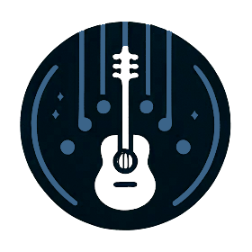

<h1 align="center">Worship Songwriting Assistant</h1>

Helps you write great songs for church services.

  <a href="https://chat.openai.com/g/g-JvfqIqEUv">Open in ChatGPT</a>
  | <a href="Instructions.md">Instructions</a>
  | <a href="LICENSE">MIT License</a>

## Features

- **Theme and Motivation Development**: Crafts a thematic motivation for a worship song, considering the theological foundation and its relevance to church liturgy.
- **Narrative Structuring**: Develops an overall narrative for the song, and designs a song structure.
- **Lyrics**: Writes lyrics, ensuring that they are cohesive, reflect the chosen theme, and fit the narrative structure.
- **Chords**: Selects chords, focusing on harmonic progression and mood.
- **PDF Generation**: Generates a PDF of the completed song, with chords in Nashville notation or a specific key.
- **Inclusive and Respectful**: Emphasises inclusive language, and emphasises respect and consideration for sensitive topics.
- **Songwriting Ethics**: Avoids copying existing songs and focuses on original creation*.

*\* The community is still in the process of developing these standards for LLMs - watch this space!*

## Conversation Starters

- Write a worship song based on Psalm 23.
- Write a simple heartfelt song about peace.
- Write a praise song about freedom and forgiveness.
- Write a traditional hymn about salvation.

## Known Issues

+ There's only a macro-structural connection between lyrics and chords, it'd be nice to nudge the model to add more micro-structure.
+ I haven't tested if the IPA transcription *actually* improves results
+ Rhythm and stress analysis might also help (if I can get it working; GPT4 is *terrible* at syllables)
+ Do the sharps and flats look a little weird to you?
+ Further discussion and feedback on [implementing Songwriting Ethics](https://github.com/amwaters/Worship-Songwriting-Assistant/issues/1) is welcome!
